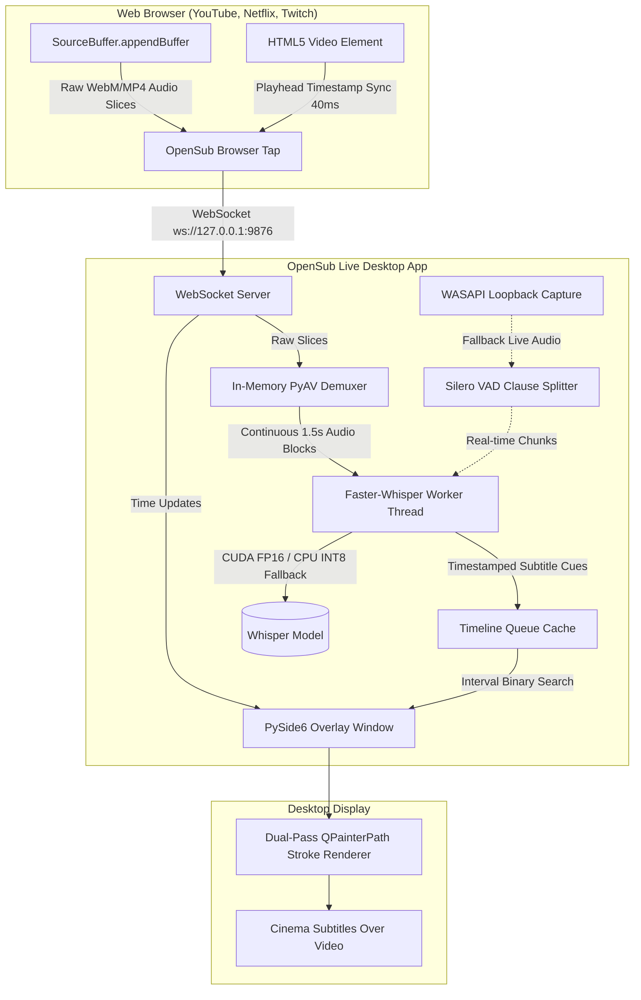

# OpenSub Live 🎬

<div align="center">


-41CD52?style=for-the-badge&logo=qt&logoColor=white)


### **Live Cinema Subtitles for Streaming Video & System Audio**
*Powered by "Hearing the Future" Ahead-of-Time Lookahead ASR.*

[Key Features](#-key-features) • [How It Works](#-how-it-works-hearing-the-future) • [Architecture](#-architecture) • [Quick Start](#-quick-start-guide) • [Controls & Shortcuts](#️-controls--shortcuts) • [Building EXE](#-packaging-standalone-exe)

</div>

---

## ⚡ How It Works: "Hearing the Future"

Standard real-time caption systems suffer from **2 to 4 seconds of perceptual lag** or jitter word-by-word like an annoying typewriter because they capture audio from the speaker output *after* it is heard.

**OpenSub Live completely re-engineers this paradigm:**

1. **Ahead-of-Time RAM Buffer Interception:** When you stream on **YouTube, Netflix, Coursera, or Twitch**, your browser downloads and buffers **10 to 45 seconds of upcoming audio** into RAM via Media Source Extensions (`SourceBuffer`).
2. **High-Speed IPC Stream:** The lightweight OpenSub browser companion captures these raw media chunks directly in memory and streams them via local WebSocket (`ws://127.0.0.1:9876`) to the desktop app.
3. **In-Memory PyAV Demuxing:** The background demuxer decodes fragmented WebM/Opus or fMP4/AAC in `<3ms` with zero disk I/O into 16kHz mono audio blocks.
4. **Predictive Whisper Transcription:** **Faster-Whisper** transcribes or translates dialogue up to **30+ seconds before it is spoken on screen**.
5. **Cinema-Timed Cue Display:** OpenSub Live stores timestamped cues in an interval queue. The millisecond the video playhead reaches that timestamp, the **complete, beautifully formatted movie subtitle line appears instantly** with **0ms perceptual latency**!
6. **Instant Rewind / Seek Support:** All pre-transcribed cues are preserved in memory. If you rewind 10 seconds to re-watch a scene, the subtitles appear immediately from the cache with zero delay.

> **Live Calls & Games Fallback:** For real-time applications without buffer lookahead (Discord, Zoom, Google Meet, PC games), OpenSub Live automatically falls back to **WASAPI Loopback Capture** with **Silero VAD Clause Chunking** to display subtitles as soon as a speaker pauses.

---

## 🏗️ Architecture



---

## 🎨 Key Features

* **Zero Perceptual Latency:** Lookahead streaming means dialogue is already transcribed in advance. Sentences appear exactly on cue without delay or audio lag.
* **Instant Rewind & Fast-Forward:** Pre-transcribed subtitle cues are cached in memory (retaining up to 1,500+ cues / ~1.5 hours). Rewinding re-reads directly from cache with 0 delay.
* **Hollywood Cinema Typography:** Dual-pass text rendering using `QPainterPath` with a **2.8px solid black stroke (`RoundJoin`)** over Cinema White or Cinema Yellow font. 100% readable over blinding white snow, fiery explosions, or pitch-black scenes.
* **True Click-Through Mode:** Press **`Ctrl+Shift+L`** or toggle the 🔓 lock icon to activate Windows `WS_EX_TRANSPARENT`. Mouse clicks pass directly through the subtitle text to control video players, games, or underlying windows.
* **Floating Control Pill:** A sleek, glassmorphic hover toolbar allowing instant font size adjustment (`A-` / `A+`), color toggle (White ⚪ / Yellow 🟡), click-through locking, settings modal, and window repositioning.
* **Real-Time Translation:** Translates dialogue from 90+ foreign languages (Japanese, Spanish, French, Korean, German, Hindi, etc.) directly into English subtitles on the fly.
* **Dual-Engine Robustness:**
  * **CUDA Acceleration (Float16):** Sub-second batch inference on NVIDIA GPUs.
  * **Automatic CPU INT8 Fallback:** Automatically detects if CUDA or cuBLAS is unavailable and falls back to CPU INT8 execution without crashing.
* **Clean Process Lifecycle:** Handles `SIGINT` (`Ctrl+C`) gracefully, shutting down audio threads, WebSocket connections, and GUI windows cleanly.

---

## 🚀 Quick Start Guide

### 1. Requirements & Setup

Ensure you have **Python 3.10+** installed on Windows.

Clone the repository and install dependencies:
```bash
git clone https://github.com/Shreyas445/OpenSub-live.git
cd OpenSub-live
pip install -r requirements.txt
```
*(Or simply double-click `scripts\install_deps.bat`)*

---

### 2. Start OpenSub Live

Run the application:
```bash
python -m src.main
```
*(Or double-click `scripts\run_app.bat`)*

The transparent subtitle overlay will float at the bottom center of your monitor.

---

### 3. Enable Browser Lookahead Audio Tap

Choose either **Option A** (Unpacked Extension) or **Option B** (Tampermonkey Userscript):

#### Option A: Unpacked Chrome / Edge Extension (Recommended)
1. Open Google Chrome or Microsoft Edge and navigate to `chrome://extensions`.
2. Toggle on **Developer mode** in the top-right corner.
3. Click **Load unpacked** and select the folder:
   ```
   OpenSub-live\bridge\extension
   ```
4. Open any YouTube video. The indicator on OpenSub Live's toolbar will turn **Green (Web Video Connected)**!

#### Option B: 1-Click Tampermonkey Userscript
1. Install [Tampermonkey](https://www.tampermonkey.net/) or Violentmonkey.
2. In the Tampermonkey dashboard, select **Create a new script**.
3. Paste the contents of [`bridge/userscript/opensub_tap.user.js`](bridge/userscript/opensub_tap.user.js) and save.

---

## ⌨️ Controls & Shortcuts

| Action | Control / Shortcut | Description |
| :--- | :--- | :--- |
| **Move Subtitles** | `Click & Drag` | Drag the `⠿ Drag` handle or subtitle area anywhere on screen |
| **Toggle Click-Through** | **`Ctrl + Shift + L`** or 🔓/🔒 | Makes subtitles click-through so you can click underlying controls |
| **Adjust Font Size** | **`A-`** / **`A+`** | Increment or decrement font size in real time |
| **Toggle Color** | **🟡 / ⚪** | Toggle between Pure Cinema White and Cine-Yellow |
| **Settings Menu** | **⚙** | Configure Whisper model size, task (Transcribe / Translate), and fonts |
| **Close Application** | **✕** or **`Ctrl + C`** in terminal | Cleanly stops all background workers and exits |

---

## ⚙️ Configuration & Customization

Settings are automatically persisted to `opensub_config.json`:

```json
{
  "model_size": "medium",
  "task": "transcribe",
  "language": null,
  "font_family": "Segoe UI",
  "font_size": 28,
  "font_color": "#FFFFFF",
  "stroke_color": "#000000",
  "stroke_width": 2.8,
  "server_port": 9876
}
```

* **`model_size`**: `"tiny"`, `"base"`, `"small"`, `"medium"`, `"large-v3"`
* **`task`**: `"transcribe"` (original language) or `"translate"` (auto-translate foreign speech into English)
* **`language`**: `null` for automatic language detection, or specific ISO code (e.g. `"ja"`, `"es"`, `"fr"`, `"de"`)

---

## 📦 Packaging Standalone `.exe`

To package OpenSub Live into a standalone Windows executable:

```bash
python scripts/build_exe.py
```

The compiled standalone executable will be generated in `dist/OpenSubLive/OpenSubLive.exe`.

---

## 📁 Repository Structure

```
OpenSub-live/
├── bridge/                         # Browser Media Interceptors
│   ├── extension/                  # Chrome / Edge Manifest V3 Companion Extension
│   │   ├── manifest.json
│   │   ├── content.js
│   │   └── mse_hook.js             # Hooks MediaSource SourceBuffer & video sync
│   └── userscript/
│       └── opensub_tap.user.js     # 1-Click Tampermonkey alternative
│
├── src/                            # Core Python Architecture
│   ├── config.py                   # Centralized configuration & persistence
│   ├── audio/
│   │   ├── demuxer.py              # In-memory PyAV stream demuxer & accumulator
│   │   ├── vad_filter.py           # Silero VAD speech clause detector
│   │   └── wasapi_loopback.py      # PyAudioWPatch loopback capture fallback
│   ├── engine/
│   │   ├── asr_worker.py           # Faster-Whisper background worker thread
│   │   └── timeline_queue.py       # Thread-safe subtitle interval queue & search
│   ├── gui/
│   │   ├── overlay_window.py       # Transparent, frameless PySide6 window
│   │   ├── subtitle_renderer.py    # Dual-pass QPainterPath stroke outline renderer
│   │   ├── control_pill.py         # Floating hover pill toolbar
│   │   └── settings_dialog.py      # Model, task, and typography settings modal
│   ├── server/
│   │   └── websocket_server.py     # Local WebSocket IPC server (port 9876)
│   ├── utils/
│   │   └── hotkey_listener.py      # Global Ctrl+Shift+L click-through listener
│   └── main.py                     # Application entry point & service coordinator
│
├── scripts/
│   ├── install_deps.bat            # 1-Click dependency installer
│   ├── run_app.bat                 # 1-Click application launcher
│   └── build_exe.py                # Standalone PyInstaller packaging script
│
├── .gitignore
├── requirements.txt
└── README.md
```

---

## 📄 License

This project is licensed under the [MIT License](LICENSE).
Feel free to use, modify, and distribute it for personal and commercial projects.
